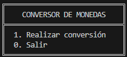
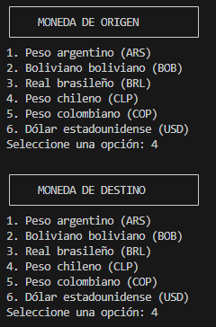
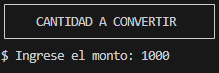
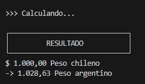

# Conversor de Monedas 💱  

Bienvenido/a a mi proyecto de conversor de monedas. Este proyecto fue creado como parte de mi aprendizaje en [Alura](https://www.aluracursos.com/) para desarrollar habilidades en programación y manipulación de datos. 🚀  

## Acerca del Proyecto 📖  

Este conversor de monedas te permite convertir entre las siguientes divisas:  
- **Peso argentino (ARS)**  
- **Boliviano boliviano (BOB)**  
- **Real brasileño (BRL)**  
- **Peso chileno (CLP)**  
- **Peso colombiano (COP)**  
- **Dólar estadounidense (USD)**  

El objetivo principal es facilitar la conversión de divisas de forma rápida, precisa y sencilla.  

## Características 🛠️  

- Conversión en tiempo real entre las monedas disponibles.  
- Fácil de usar.  
- Validación de datos de entrada para evitar errores comunes.  
- Tasas de cambio actualizables.  

## Capturas de Pantalla 📸  

Imagenes del conversor
#### Menú del conversor

#### Selector de moneda origen y destino

#### Monto a convertir

#### Resultado


## Tecnologías Utilizadas 🖥️ 

Este proyecto fue desarrollado con:  
- Lenguaje de programación: Java.
- Libreria Gson en Java.

## Instalación y Uso 🚀  

Sigue estos pasos para ejecutar el proyecto en tu máquina:  

1. Clona este repositorio:  
   ```bash  
   git clone https://github.com/maria-campora/conversor-monedas.git

2. Navega al directorio del proyecto:
    ```bash
   cd conversor-monedas

3. Ejecuta la aplicación:
    ```bash
   En tu editor de código o IDE Haz clic en "Run Java"

4. ¡Empieza a convertir monedas! 🌟

## Cómo Contribuir 🤝

¿Tienes ideas para mejorar este proyecto? ¡Me encantaría conocerlas! Puedes contribuir de la siguiente manera:

1. Realiza un fork de este repositorio.

2. Crea una rama con tu nueva funcionalidad:
    ```bash
    git checkout -b mi-nueva-funcionalidad 

3. Realiza tus cambios y haz un commit:
    ```bash
    git commit -m "Agrega una nueva funcionalidad" 

4. Envía un pull request.

## Sobre Mí 🙋‍♀️

Mi nombre es María Cámpora, estudiante en Alura. Estoy apasionada por la programación y en constante aprendizaje para crear proyectos que faciliten la vida de las personas.